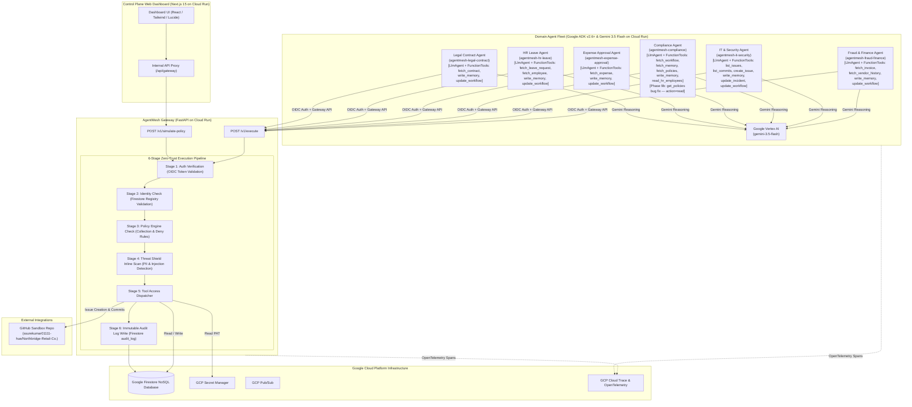

# AgentMesh — Production Architecture & Implementation Diagram

## System Architecture

---

## Live Cloud Run Service Endpoints & Resources

| Service / Component | Service ID / Identifier | Real Deployed URL |
|---|---|---|
| **Control Plane Dashboard** | `agentmesh-dashboard` | https://agentmesh-dashboard-138003672216.asia-south1.run.app |
| **AgentMesh Gateway** | `agentmesh-gateway` | https://agentmesh-gateway-138003672216.asia-south1.run.app |
| **Fraud & Finance Agent** | `agentmesh-fraud-finance` | https://agentmesh-fraud-finance-138003672216.asia-south1.run.app |
| **IT & Security Agent** | `agentmesh-it-security` | https://agentmesh-it-security-138003672216.asia-south1.run.app |
| **Compliance Agent** | `agentmesh-compliance` | https://agentmesh-compliance-138003672216.asia-south1.run.app |
| **Expense Approval Agent** | `agentmesh-expense-approval` | https://agentmesh-expense-approval-138003672216.asia-south1.run.app |
| **HR Leave Agent** | `agentmesh-hr-leave` | https://agentmesh-hr-leave-138003672216.asia-south1.run.app |
| **Legal Contract Agent** | `agentmesh-legal-contract` | https://agentmesh-legal-contract-138003672216.asia-south1.run.app |
| **GitHub Sandbox Repository** | `Northbridge-Retail-Co.` | https://github.com/ssurekumar01111-hue/Northbridge-Retail-Co. |
| **GCP Cloud Trace Console** | `agentmesh-fleet-2026` | https://console.cloud.google.com/traces/traces?project=agentmesh-fleet-2026 |

---

## ADK Adoption Status (All 6 Agents — Genuine ADK Runner Rollout Complete)

| Agent | ADK LlmAgent | FunctionTools (Exclusive Call Path) | ADK Runner (`run_async`) | Session Service | Status |
|---|---|---|---|---|---|
| fraud-finance | ✅ | fetch_invoice, fetch_vendor_history, write_memory, update_workflow | ✅ | InMemorySessionService | Phase 13a Verified |
| it-security | ✅ | list_issues, list_commits, create_issue, write_memory, update_incident, update_workflow | ✅ | InMemorySessionService | Phase 13b Verified |
| compliance | ✅ | fetch_workflow, fetch_memory, fetch_policies, write_memory, read_hr_employees | ✅ | InMemorySessionService | Phase 13b Verified |
| expense-approval | ✅ | fetch_expense, write_memory, update_workflow | ✅ | InMemorySessionService | Phase 13b Verified |
| hr-leave | ✅ | fetch_leave_request, fetch_employee, write_memory, update_workflow | ✅ | InMemorySessionService | Phase 13b Verified |
| legal-contract | ✅ | fetch_contract, write_memory, update_workflow | ✅ | InMemorySessionService | Phase 13b Verified |

---

## Real Execution Flow & Zero-Trust Guarantees

1. **Identity & Auth Isolation**: Each agent runs as a distinct Google Service Account (`agentmesh-fraud-finance@...`, `agentmesh-it-security@...`, `agentmesh-compliance@...`, `agentmesh-expense-approval@...`, `agentmesh-hr-leave@...`, `agentmesh-legal-contract@...`).
2. **Genuine ADK Runner Loop**: All 6 domain agents run tool calls exclusively through Google ADK `Runner.run_async()` tool-execution loop (`LlmAgent` + `FunctionTool` closures). There are no manual or out-of-band call paths to these functions outside the Runner.
3. **Gateway Mediation**: Agents never communicate directly with Firestore or GitHub; all tool access requests pass through the Gateway pipeline via ADK FunctionTools wrapping GatewayClient calls.
4. **Authoritative Timestamps**: All write actions use ISO 8601 UTC timestamps set dynamically (`datetime.now(timezone.utc).isoformat()`), replacing literal placeholders.
5. **Threat Shield (Guard Pipeline)**: Every inbound payload and outbound response is scanned for prompt injection, secret leakage, and PII.
6. **Persisted Workflow Resumption**: Paused workflows store state in Firestore (`workflows` collection), surviving Cloud Run process restarts.
7. **Distributed OpenTelemetry Tracing**: Every pipeline execution emits spans exported directly to GCP Cloud Trace for end-to-end observability. ADK's internal tracer runs on a separate namespace — no conflict with each agent's `telemetry.py` tracer.
