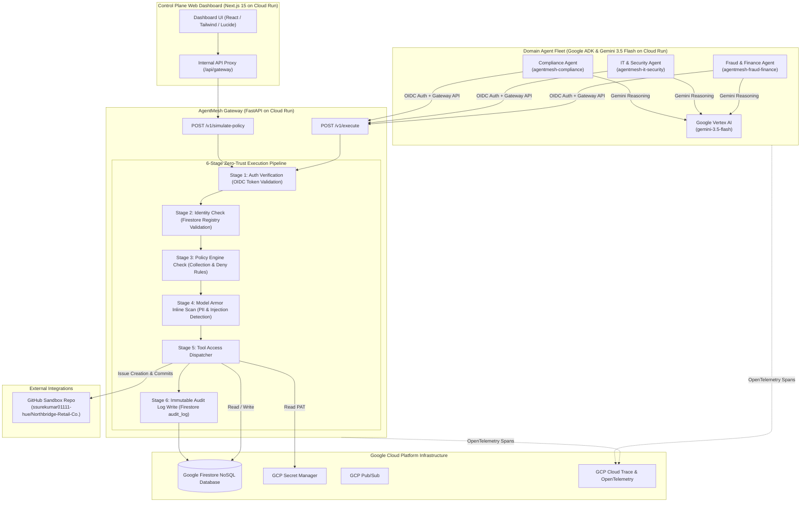

# AgentMesh — Production Architecture & Implementation Diagram

## System Architecture

---

## Live Cloud Run Service Endpoints & Resources

| Service / Component | Service ID / Identifier | Real Deployed URL |
|---|---|---|
| **Control Plane Dashboard** | `agentmesh-dashboard` | https://agentmesh-dashboard-138003672216.asia-south1.run.app |
| **AgentMesh Gateway** | `agentmesh-gateway` | https://agentmesh-gateway-138003672216.asia-south1.run.app |
| **Fraud & Finance Agent** | `agentmesh-fraud-finance` | https://agentmesh-fraud-finance-138003672216.asia-south1.run.app |
| **IT & Security Agent** | `agentmesh-it-security` | https://agentmesh-it-security-138003672216.asia-south1.run.app |
| **Compliance Agent** | `agentmesh-compliance` | https://agentmesh-compliance-138003672216.asia-south1.run.app |
| **GitHub Sandbox Repository** | `Northbridge-Retail-Co.` | https://github.com/ssurekumar01111-hue/Northbridge-Retail-Co. |
| **GCP Cloud Trace Console** | `agentmesh-fleet-2026` | https://console.cloud.google.com/traces/traces?project=agentmesh-fleet-2026 |

---

## Real Execution Flow & Zero-Trust Guarantees

1. **Identity & Auth Isolation**: Each agent runs as a distinct Google Service Account (`agentmesh-fraud-finance@...`, `agentmesh-it-security@...`, `agentmesh-compliance@...`).
2. **Gateway Mediation**: Agents never communicate directly with Firestore or GitHub; all tool access requests pass through the Gateway pipeline.
3. **Model Armor**: Every inbound payload and outbound response is scanned for prompt injection, secret leakage, and PII.
4. **Persisted Workflow Resumption**: Paused workflows store state in Firestore (`workflows` collection), surviving Cloud Run process restarts.
5. **Distributed OpenTelemetry Tracing**: Every pipeline execution emits spans exported directly to GCP Cloud Trace for end-to-end observability.
