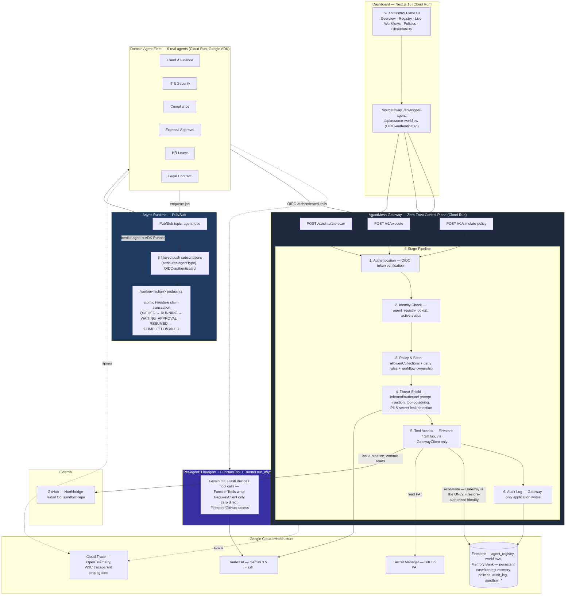

# AgentMesh — Production Architecture & Implementation Diagram

## System Architecture

---

## Live Cloud Run Service Endpoints & Resources

| Service / Component | Service ID / Identifier | Real Deployed URL |
|---|---|---|
| **Control Plane Dashboard** | `agentmesh-dashboard` | https://agentmesh-dashboard-138003672216.asia-south1.run.app |
| **AgentMesh Gateway** | `agentmesh-gateway` | https://agentmesh-gateway-138003672216.asia-south1.run.app |
| **Fraud & Finance Agent** | `agentmesh-fraud-finance` | https://agentmesh-fraud-finance-138003672216.asia-south1.run.app |
| **IT & Security Agent** | `agentmesh-it-security` | https://agentmesh-it-security-138003672216.asia-south1.run.app |
| **Compliance Agent** | `agentmesh-compliance` | https://agentmesh-compliance-138003672216.asia-south1.run.app |
| **Expense Approval Agent** | `agentmesh-expense-approval` | https://agentmesh-expense-approval-138003672216.asia-south1.run.app |
| **HR Leave Agent** | `agentmesh-hr-leave` | https://agentmesh-hr-leave-138003672216.asia-south1.run.app |
| **Legal Contract Agent** | `agentmesh-legal-contract` | https://agentmesh-legal-contract-138003672216.asia-south1.run.app |
| **Pub/Sub Async Job Topic** | `agent-jobs` | `projects/agentmesh-fleet-2026/topics/agent-jobs` |
| **GitHub Sandbox Repository** | `Northbridge-Retail-Co.` | https://github.com/ssurekumar01111-hue/Northbridge-Retail-Co. |
| **GCP Cloud Trace Console** | `agentmesh-fleet-2026` | https://console.cloud.google.com/traces/traces?project=agentmesh-fleet-2026 |

---

## ADK Adoption Status (All 6 Agents — Genuine ADK Runner Rollout Complete)

| Agent | ADK LlmAgent | FunctionTools (Exclusive Call Path) | ADK Runner (`run_async`) | Session Service | Status |
|---|---|---|---|---|---|
| fraud-finance | ✅ | fetch_invoice, fetch_vendor_history, write_memory, update_workflow | ✅ | InMemorySessionService | Phase 13a Verified |
| it-security | ✅ | list_issues, list_commits, create_issue, write_memory, update_incident, update_workflow | ✅ | InMemorySessionService | Phase 13b Verified |
| compliance | ✅ | fetch_workflow, fetch_memory, fetch_policies, write_memory, read_hr_employees | ✅ | InMemorySessionService | Phase 13b Verified |
| expense-approval | ✅ | fetch_expense, write_memory, update_workflow | ✅ | InMemorySessionService | Phase 13b Verified |
| hr-leave | ✅ | fetch_leave_request, fetch_employee, write_memory, update_workflow | ✅ | InMemorySessionService | Phase 13b Verified |
| legal-contract | ✅ | fetch_contract, write_memory, update_workflow | ✅ | InMemorySessionService | Phase 13b Verified |

---

## Real Execution Flow & Zero-Trust Guarantees

1. **Identity & Auth Isolation**: Each agent runs with its own dedicated Google Service Account (`agentmesh-fraud-finance@...`, `agentmesh-it-security@...`, etc.). All service-to-service communication is authenticated via Google Cloud Run OIDC ID tokens.
2. **Async Pub/Sub Runtime & Atomic Job Claim**: Background workflows are dispatched asynchronously through the `agent-jobs` Pub/Sub topic and routed to agents via filtered push subscriptions. Worker endpoints (`/worker/<action>`) execute transactional atomic claim operations (`queued` → `running`) directly through the Gateway to guarantee race-safe execution across concurrent instances.
3. **Stage 3 Policy Check & Workflow Ownership**: Enforces `allowedCollections`, cross-department deny rules (`policies` collection), and strict workflow ownership verification ensuring only assigned or initiating agent identities can modify workflow state.
4. **Stage 4 Threat Shield (Guard Pipeline)**: Dual-layer security scanning combining fast regex armor (secrets, PII, known injection patterns) and a live **Vertex AI Gemini 3.5 Flash** classifier on both inbound payloads and outbound tool responses. Simulation scans (`/v1/simulate-scan`) allow zero-execution testing via the Dashboard Threat Shield Playground.
5. **Gateway-Only Tool & Database Access**: Domain agents hold zero direct permissions on Firestore or GitHub. The Gateway is the **only** authorized identity permitted to read/write Firestore collections and access Secret Manager for GitHub PAT tokens. Agents interact with external resources strictly via ADK `FunctionTool` closures wrapping `GatewayClient`.
6. **Genuine ADK Runner Loop**: All 6 domain agents reason and invoke tools exclusively through Google ADK `Runner.run_async()` (`LlmAgent` + Gemini 3.5 Flash), maintaining strict separation between reasoning and tool execution.
7. **Persisted Workflow Resumption & Governance**: Paused workflows (`waiting_approval`) persist their state in Firestore (`workflows` and `memory` collections). Human approval actions dispatched from the Dashboard trigger `/resume` endpoints, allowing agents to seamlessly complete multi-step tasks across process restarts.
8. **Distributed OpenTelemetry Observability**: End-to-end W3C `traceparent` context propagation across Dashboard, Pub/Sub, Agents, and Gateway pipelines exports granular distributed trace spans directly to Google Cloud Trace.
